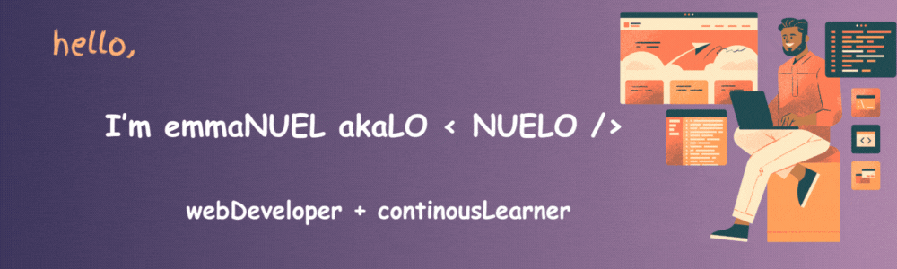

  

### whoAmI
Web developer diving into the MERN stack, passionate about Web3 and open-source contributions.  
Always learning, building, and collaborating!

### Technology & Tools

### find me

### stat

  
  

